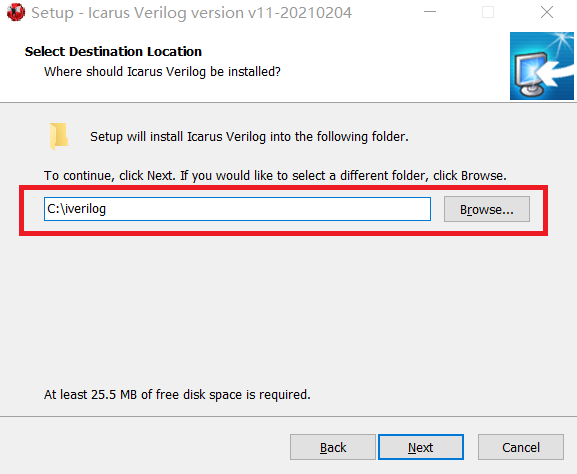
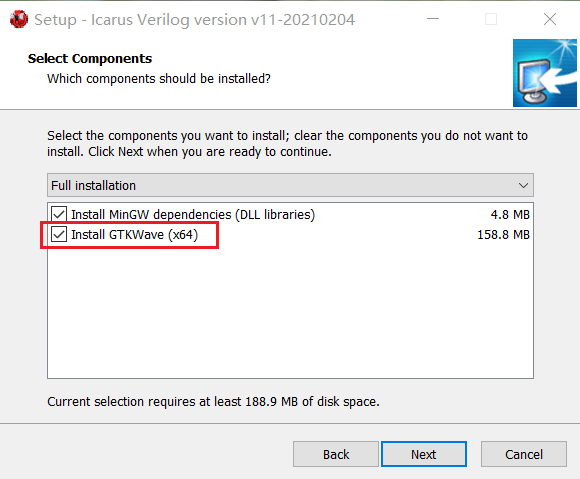
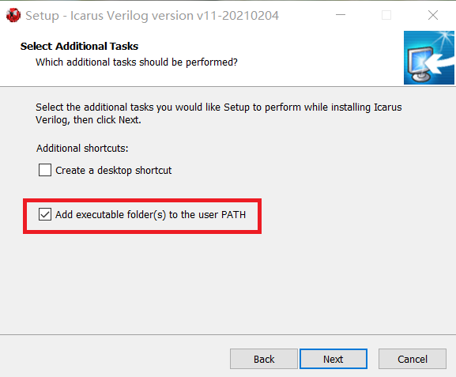

# iverilog 仿真教程

使用开源的 iverilog + gtkwave 工具链可以进行轻量级的、无需建立工程的 Verilog/SystemVerilog 仿真，用起来非常方便。

本文档讲解在 Windows 上搭建和使用 iverilog 。


## 安装 iverilog

前往 http://bleyer.org/icarus/ 下载最新版本的 iverilog 的 Windows 安装程序（比如我选择的是 **iverilog-v11-20210204-x64\_setup\.exe**），运行它。

在 Select Destination Location 步骤，选择你想安装的位置，如下图，默认位置是 **C:\iverilog** ，默认位置即可。



在 Select Components 步骤，要勾选上 **Install GTKWave** ，如下图：



在 Select Additional Tasks 步骤，要勾选上 **Add executable folder(s) to the user PATH** ，如下图，确保把 iverilog 加入环境变量，这样你才能用命令行（CMD、Powershell）中使用它们。



然后就等待安装，大概不到一分钟，因为软件很小（不到200MB）。


## 验证安装

安装好后验证安装是否成功，打开命令行（Powershell），方法是在桌面或在任意一个文件夹里按 Shift+鼠标右键 → 点击“在此处打开 Powershell 窗口” 。

在 Powershell 中，输入：

```powershell
iverilog
```

可以看到打印了如下 iverilog 的使用说明，这就说明 iverilog 安装成功。

```powershell
Usage: iverilog [-EiSuvV] [-B base] [-c cmdfile|-f cmdfile]
                [-g1995|-g2001|-g2005|-g2005-sv|-g2009|-g2012] [-g<feature>]
                [-D macro[=defn]] [-I includedir] [-L moduledir]
                [-M [mode=]depfile] [-m module]
                [-N file] [-o filename] [-p flag=value]
                [-s topmodule] [-t target] [-T min|typ|max]
                [-W class] [-y dir] [-Y suf] [-l file] source_file(s)
```

然后在 Powershell 中输入：

```powershell
gtkwave
```

如果弹出一个窗口，说明 gtkwave 安装成功。


## 准备代码

准备你需要仿真的 Verilog 代码文件，比如编写一个带计数器的 hello world：

```verilog
// 文件名 hello.sv
module tb_hello ();
    initial $dumpvars(0, tb_hello);  // 指定要导出哪些信号的波形！！！
                                     // 这里导出了 tb_hello 内的所有信号的波形
    
  	reg clk=1'b1;                    // 时钟
  	always #10000 clk = ~clk;
    
    reg [31:0] cnt = 0;
    always @ (posedge clk)
        if(cnt < 5) begin            // 计数器cnt从0计数到5
            cnt <= cnt + 1;
        end else begin               // 计数到5后退出仿真
            $display("hello world");
            $finish;
        end
endmodule
```

> Verilog 代码文件后缀为 .v ，SystemVerilog 代码文件后缀为 .sv

注意：以上代码中有一句 `$dumpvars(0, tb_hello);` ，代表仿真时需要导出 `tb_hello` 这个模块下的所有信号的波形，`0` 则代表该模块下的子模块中的所有信号也要导出（如果该模块有调用子模块的话）。一般我们就这样导出所有信号。除非仿真信号很多，我们可以只导出一部分信号来防止占用太多磁盘空间（具体请搜索 `$dumpvars` 的使用方法）。


## 编译和运行仿真

在 hello.sv 所在的文件夹下，按 Shift+鼠标右键 → 点击“在此处打开 Powershell 窗口” ，打开 Powershell 。然后输入编译命令：

```powershell
iverilog -g2005-sv -o sim.out hello.sv
```

该命令的含义是：

- 用 iverilog 编译 hello.sv 
- 生成仿真可执行文件 sim.out 
- -g2005-sv 代表语言标准为 SystemVerilog-2005 。

关于语言标准，你可以用以下选项，高版本是向下兼容低版本的，比如你的代码使用 Verilog-2001 编写，那么这个选项也可以设为 -g2012 。

| 选项      | 语言标准           | IEEE 标准     | 备注               |
| --------- | ------------------ | ------------- | ------------------ |
| -g1995    | Verilog-1995       | IEEE1364-1995 |                    |
| -g2001    | Verilog-2001       | IEEE1364-2001 |                    |
| -g2005    | Verilog-2005       | IEEE1364-2005 | 推荐使用（2022年） |
| -g2005-sv | SystemVerilog-2005 | IEEE1800-2005 | 推荐使用（2022年） |
| -g2009    | SystemVerilog-2009 | IEEE1800-2009 |                    |
| -g2012    | SystemVerilog-2012 | IEEE1800-2012 |                    |

> 目前（2022年）进行 FPGA 开发推荐使用的是 Verilog-2005 和 SystemVerilog-2005 ，因为各种 FPGA 开发环境支持的最全。

编译好后，可以看到生成了一个 sim.out 文件。然后用 vvp 运行它进行仿真（同时会记录下波形）：

```powershell
vvp -n sim.out
```

可以看到 “hello world” 被打印出来，并产生了一个波形文件 dump.vcd 。


## 查看波形

用以下命令打开 gtkwave 查看波形文件：

```powershell
gtkwave dump.vcd
```

弹出 gtkwave 波形窗口的，基本使用方法如下图：

|  |
| :------------------------------: |
|    图：gtkwave 基本使用方式。    |


## 自动化

你也可以不打开命令行，只靠点点点就能进行仿真、察看波形（可以，这很 Windows）。

在 `hello.sv` 所在的目录下新建一个 `hello_run_iverilog.bat` 文件（.bat 是 Windows 批处理文件的后缀），用编辑器打开它，在其中写入：

```powershell
del sim.out dump.vcd
iverilog -g2005-sv -o sim.out hello.sv
vvp -n sim.out
pause
```

其中 `del sim.out dump.vcd` 是为了在编译失败时也能删掉 sim.out 和 dump.vcd 文件（如果有的话），避免让你误以为编译成功并产生了 dump.vcd （实际上这可能是上次编译成功时生成的波形）。

然后你可以双击 `hello_run_iverilog.bat` 来一键进行编译和运行仿真。这样可以免得调试时每次修改代码后都要手打两个命令。

为了快捷地打开 gtkwave 窗口查看波形，推荐把 **gtkwave.exe** 设置为 `.vcd` 文件的打开方式，操作如下图。这样，今后只要双击 `dump.vcd` 文件就能查看波形。

|        |
| :-----------------------------------------: |
| 图：把 gtkwave.exe 设为 .vcd 文件的打开方式 |


## 编译多个文件

一般的仿真都涉及多个 Verilog 或 SystemVerilog 代码文件，此时编译命令应该类似这样：

```
iverilog -g2005-sv -o sim.out file1.sv file2.sv ./RTL/file3.v ../RTL/file4.v
```

注意命令中 `.` 代表当前目录（也就是你打开的 Powershell 窗口当前所在的文件夹）， `..` 代表上一层目录。这里：

- `./RTL/file3.v` 代表当前目录中的 RTL 目录下的 file3.v 
- `../RTL/file4.v` 代表当前目录中的上一层目录中的 RTL 目录下的 file4.v 

iverilog 会自动寻找最顶层的模块作为顶层进行仿真。但一般习惯把顶层文件放在第一个，比如这里 file1.sv 是顶层文件。


如果你觉得 iverilog 仿真方式好用，去给 https://github.com/steveicarus/iverilog 和 https://github.com/gtkwave/gtkwave 点个 star 吧，拒做白嫖，从我做起。
