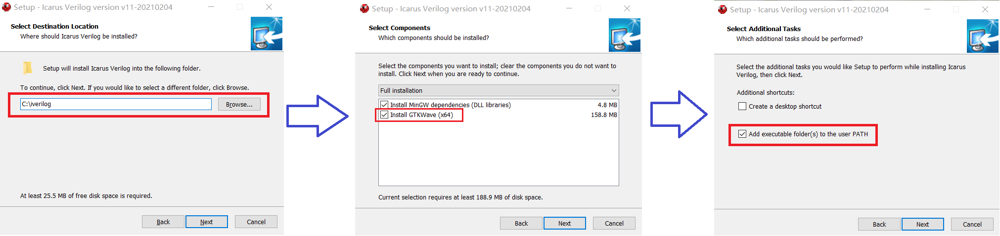
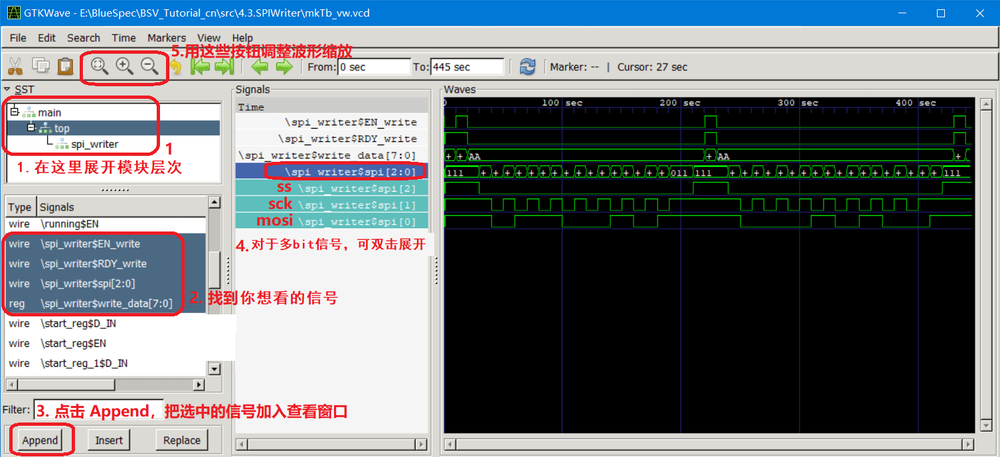
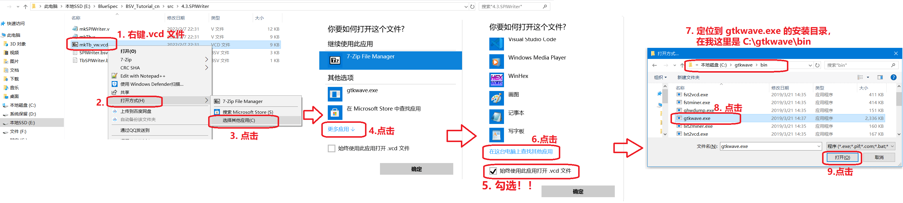

中文 | [English](#en)

# Windows iverilog 仿真教程

iverilog + gtkwave 工具链提供了轻量级的、无需建立工程的 Verilog/SystemVerilog 仿真方式，用起来非常方便。

本文档讲解在 Windows 中搭建和使用 iverilog 。


## 安装 iverilog

前往 [bleyer.org/icarus](http://bleyer.org/icarus/) 下载 iverilog 的 Windows 安装程序，请选择 **iverilog-v11-20201123-x64_setup\.exe [18.1MB]** （不要选择最新的 **iverilog-v11-20210204-x64\_setup\.exe [44.1MB]** ，因为它配套的 gtkwave 很卡）。

然后运行安装程序。注意以下步骤：

- 如图1(左)，选择你想安装的位置，默认位置是 **C:\iverilog** ，使用默认位置即可。
- 如图1(中)，要勾选上 **Install GTKWave** 
- 如图1(右)，要勾选上 **Add executable folder(s) to the user PATH** ，确保把 iverilog 加入环境变量，这样你才能用命令行（CMD、Powershell）中使用它们。

|  |
| :---------------------------------------------: |
|         **图1**：iverilog 安装注意事项          |

然后就等待安装，装起来很快，因为软件很小（不到100MB）。


## 验证安装

安装好后验证安装是否成功，打开命令行（Powershell），方法是在桌面或在任意一个文件夹里按 Shift+鼠标右键 → 点击“在此处打开 Powershell 窗口” 。

在 Powershell 中，输入：

```powershell
iverilog
```

可以看到打印了如下 iverilog 的使用说明，这就说明 iverilog 安装成功。

```powershell
Usage: iverilog [-EiSuvV] [-B base] [-c cmdfile|-f cmdfile]
                [-g1995|-g2001|-g2005|-g2005-sv|-g2009|-g2012] [-g<feature>]
... 省略 ...
```

然后在 Powershell 中输入：

```powershell
gtkwave
```

如果弹出一个窗口，说明 gtkwave 安装成功。


## 准备代码

准备你需要仿真的 Verilog 代码文件，比如编写一个带计数器的 hello world：

```verilog
// 文件名 hello.sv
module tb_hello ();
    initial $dumpvars(0, tb_hello);  // 指定要导出哪些信号的波形！！这里导出了 tb_hello 内的所有信号
    
  	reg clk=1'b1;                    // 时钟
  	always #10000 clk = ~clk;
    
    reg [31:0] cnt = 0;
    always @ (posedge clk)
        if(cnt < 5) begin            // 计数器cnt从0计数到5
            cnt <= cnt + 1;
        end else begin               // 计数到5后退出仿真
            $display("hello world");
            $finish;
        end
endmodule
```

> Verilog 代码文件后缀为 .v ，SystemVerilog 代码文件后缀为 .sv

#### $dumpvars 系统调用

这里需要讲一下以上代码中的 `$dumpvars` 系统调用。

 `$dumpvars(0, tb_hello);`  代表仿真时需要导出 `tb_hello` 这个模块下的所有信号的波形到波形文件（.vcd）中。其中：

- 第一个参数=0，代表要导出该模块和该模块调用的所有子模块中的信号（如果该模块有调用子模块的话）。
- 第一个参数=1，代表只导出一层模块的信号（也就是只导出自身的信号，不导出子模块的信号）。
- 第一个参数=2，代表只导出两层模块的信号（也就是只导出自身和一层子模块的信号，不导出子模块的子模块的信号）。

一般我们就让第一个参数=0，导出所有信号。除非仿真信号很多，我们可以只导出一部分信号来防止占用太多磁盘空间。


## 编译和运行仿真

在 hello.sv 所在的文件夹下，按 Shift+鼠标右键 → 点击“在此处打开 Powershell 窗口” ，打开 Powershell 。然后输入编译命令：

```powershell
iverilog -g2005-sv -o sim.out hello.sv
```

该命令的含义是：

- 用 iverilog 编译 `hello.sv`
- 生成仿真可执行文件 `sim.out` 
- `-g2005-sv` 代表语言标准为 SystemVerilog-2005 。

如果你的 Verilog 代码有语法错误，编译时会报错，请根据报错来修改代码。

关于语言标准，可用的编译选项如下表。其中高版本向下兼容低版本，比如你的代码使用 Verilog-2001 编写，那么这个编译选项也可以设为 `-g2012` 。

| 选项      | 语言标准           | IEEE 标准     | 备注               |
| --------- | ------------------ | ------------- | ------------------ |
| -g1995    | Verilog-1995       | IEEE1364-1995 |                    |
| -g2001    | Verilog-2001       | IEEE1364-2001 |                    |
| -g2005    | Verilog-2005       | IEEE1364-2005 | 推荐使用（2022年） |
| -g2005-sv | SystemVerilog-2005 | IEEE1800-2005 | 推荐使用（2022年） |
| -g2009    | SystemVerilog-2009 | IEEE1800-2009 |                    |
| -g2012    | SystemVerilog-2012 | IEEE1800-2012 |                    |

> 目前（2022年）进行 FPGA 开发推荐使用的是 Verilog-2005 和 SystemVerilog-2005 ，因为各种 FPGA 开发环境支持的最全。

编译好后，可以看到生成了一个 sim.out 文件。然后用 vvp 运行它进行仿真（同时会记录下波形）：

```powershell
vvp -n sim.out
```

可以看到 “hello world” 被打印出来，并产生了一个波形文件 dump.vcd 。


## 查看波形

用以下命令打开 gtkwave 查看波形文件：

```powershell
gtkwave dump.vcd
```

弹出 gtkwave 波形窗口。基本使用方法如下图：

|  |
| :-------------------------------------------: |
|        **图2**：gtkwave 基本使用方式。        |

注意：当你需要调整代码并重新仿真时，不需要关掉 gtkwave ，而是直接运行仿真，重新生成 dump.vcd ，然后在 gtkwave 中点击上方的 Reload 按钮，重新加载 dump.vcd ，这样你之前添加的波形就不会消失。


## 自动化

你也可以不打开命令行，只靠点点点就能进行仿真、察看波形（可以，这很 Windows）。

#### 使用 .bat 脚本进行仿真

在 `hello.sv` 所在的目录下新建一个 `hello_run_iverilog.bat` 文件（.bat 是 Windows 脚本文件的后缀），用编辑器打开它，在其中写入：

```powershell
del sim.out dump.vcd
iverilog -g2005-sv -o sim.out hello.sv
vvp -n sim.out
pause
```

其中 `del sim.out dump.vcd` 是为了在编译失败时也能删掉 sim.out 和 dump.vcd 文件（如果有的话），避免让你误以为编译成功并产生了 dump.vcd （实际上这可能是上次编译成功时生成的波形）。

然后你可以双击 `hello_run_iverilog.bat` 来一键进行编译和运行仿真。这样可以免得调试时每次修改代码后都要手打两个命令。

#### 把 .vcd 文件的打开方式设为 gtkwave

为了快捷地打开 gtkwave 窗口查看波形，推荐把 .vcd 文件的默认打开方式设为 gtkwave.exe 。

操作如下图。这样今后只要双击 `dump.vcd` 文件就能查看波形。

|  |
| :-----------------------------------------------------: |
|    **图3**：把 gtkwave.exe 设为 .vcd 文件的打开方式     |


## 编译多个文件

一般的仿真都涉及多个 Verilog 或 SystemVerilog 代码文件，此时编译命令应该类似这样：

```powershell
iverilog -g2005-sv -o sim.out file1.sv ./file2.v ./RTL/file3.sv ../RTL/file4.v
```

以上命令中 `.` 代表当前目录（也就是 .bat 文件所在的文件夹）， `..` 代表上一层目录。因此这里：

- `file1.sv` 和 `file2.v` 来自当前目录
- `file3.sv` 来自当前目录下的 RTL 目录
- `file4.v` 来自当前目录的上一层目录下的 RTL 目录

iverilog 会自动寻找最顶层的模块作为顶层进行仿真。但一般习惯把顶层文件放在第一个，比如这里 `file1.sv` 是顶层文件。

另外，如果你的仿真需要调用某个目录中的所有 `.v` 或 `.sv` 文件，可以用通配符 `*` ，比如：

```powershell
iverilog -g2005-sv -o sim.out file1.sv ./RTL/*.sv
```

以上命令代表 RTL 目录下的所有 `.sv` 文件都参与仿真。


## 其它注意事项

- testbentch 代码中结束仿真推荐用 `$finish` 而不用`$stop` ，因为 `$finish` 可以直接结束仿真并退出，而不需要手动退出。


## 参考链接

- iverilog 官网：[iverilog.icarus.com](http://iverilog.icarus.com/)
- iverilog 手册：[iverilog.wikia.com/wiki/User_Guide](http://iverilog.wikia.com/wiki/User_Guide)
- gtkwave 官网：[gtkwave.sourceforge.net](http://gtkwave.sourceforge.net/)
- gtkwave 手册：[gtkwave.sourceforge.net/gtkwave.pdf](http://gtkwave.sourceforge.net/gtkwave.pdf)

如果你觉得 iverilog 好用，去给他们的 github 库点个 star 吧，拒绝白嫖，从我做起：

- [github.com/steveicarus/iverilog](https://github.com/steveicarus/iverilog)
- [github.com/gtkwave/gtkwave](https://github.com/gtkwave/gtkwave)


# <span id="en">iverilog simulation tutorial for Windows</span>

The **iverilog** + **gtkwave** tool chain provides a lightweight Verilog/SystemVerilog simulation method that does not need to create a project, which is very convenient to use.

This document introduct how to build and use **iverilog** on Windows.


## Install iverilog

Go to [bleyer.org/icarus](http://bleyer.org/icarus/) to download the Windows installer of iverilog, select **iverilog-v11-20201123-x64_setup\.exe [18.1MB]** (do not select the latest **iverilog-v11-20210204-x64\_setup\.exe [44.1MB]** , because its gtkwave often stucks).

Then run the installer. Note the following steps:

- As shown in **Figure1** (left), select the location you want to install, the default location is **C:\iverilog** , just use the default location.
- As shown in **Figure1** (middle), check **Install GTKWave**
- As shown in **Figure1** (right), check **Add executable folder(s) to the user PATH** to make sure to add iverilog to the environment variable so that you can use them from the command line (CMD and Powershell).

|  |
| :---------------------------------------------: |
|   **Figure1** : iverilog installation notes.    |

Then wait for the installation, which is very fast because the software is small (less than 100MB).


## Verify Installation

To verify that the installation is successful, open the command line (Powershell) by pressing Shift + right-click on the desktop or in any folder → click "Open Powershell window here".

In Powershell, enter:

```powershell
iverilog
```

You can see that the following iverilog usage is printed, which means that the installation is successful.

```powershell
Usage: iverilog [-EiSuvV] [-B base] [-c cmdfile|-f cmdfile]
                [-g1995|-g2001|-g2005|-g2005-sv|-g2009|-g2012] [-g<feature>]
... omit more ...
```

Then enter in Powershell:

```powershell
gtkwave
```

If a window pops up, gtkwave has been successfully installed.


## Prepare Source Code

Prepare the Verilog code file you need to simulate. Here gives a hello world counter demo:

```verilog
// 文件名 hello.sv
module tb_hello ();
    initial $dumpvars(0, tb_hello);  // 指定要导出哪些信号的波形！！这里导出了 tb_hello 内的所有信号
    
  	reg clk=1'b1;                    // 时钟
  	always #10000 clk = ~clk;
    
    reg [31:0] cnt = 0;
    always @ (posedge clk)
        if(cnt < 5) begin            // 计数器cnt从0计数到5
            cnt <= cnt + 1;
        end else begin               // 计数到5后退出仿真
            $display("hello world");
            $finish;
        end
endmodule
```

> Verilog source file suffix is `.v` , SystemVerilog source file suffix is `.sv`

#### $dumpvars System Call

Here we need to talk about the `$dumpvars` system call in the above code.

  `$dumpvars(0, tb_hello);` means that the waveforms of all signals under the module `tb_hello` need to be exported to the waveform file (.vcd) during simulation. where:

- If the first argument = 0, it means to export the signal in this module and all submodules called by this module (if the module has calling submodules).
- If the first argument = 1, it means that only the signals of one layer of modules are exported (that is, only their own signals are exported, and the signals of sub-modules are not exported).
- If the first argument = 2, it means that only the signals of two-layer modules are exported (that is, only the signals of itself and one-layer sub-modules are exported, but the signals of sub-modules of sub-modules are not exported).

Generally, we let the first parameter = 0 to export all signals. Unless there are a lot of signals, we can export only a few signals to prevent taking up too much disk space.


## Compile and Run Simulation

In the folder where hello.sv is located, press Shift + right-click → click "Open Powershell window here" to open Powershell. Then enter a command to compile:

```powershell
iverilog -g2005-sv -o sim.out hello.sv
```

The meaning of this command is:

- Compile `hello.sv` with iverilog.
- Generate simulation executable file `sim.out`
- `-g2005-sv` means the language standard is SystemVerilog-2005.

If your Verilog code has syntax errors, errors will occur while compiling, please fix the error according to the report.

Regarding language standards, the available compilation options are listed in the following table. The higher version is backward compatible with the lower version. For example, if your code is written in Verilog-2001, then this compilation option can be set to `-g2012` .

| Option    | Language Standard  | IEEE Standard | Remark                |
| --------- | ------------------ | ------------- | --------------------- |
| -g1995    | Verilog-1995       | IEEE1364-1995 |                       |
| -g2001    | Verilog-2001       | IEEE1364-2001 |                       |
| -g2005    | Verilog-2005       | IEEE1364-2005 | Recommended (in 2022) |
| -g2005-sv | SystemVerilog-2005 | IEEE1800-2005 | Recommended (in 2022) |
| -g2009    | SystemVerilog-2009 | IEEE1800-2009 |                       |
| -g2012    | SystemVerilog-2012 | IEEE1800-2012 |                       |

> Currently (2022), Verilog-2005 and SystemVerilog-2005 are recommended for FPGA development, because various FPGA development environments support them completely.

After compiling, you can see that a **sim.out** file is generated. Then run it with vvp to simulate (and also export the waveform):

```powershell
vvp -n sim.out
```

You can see that "hello world" is printed and a waveform file **dump.vcd** is generated.


## View Waveform

Open gtkwave to view the wave file with the following command:

```powershell
gtkwave dump.vcd
```

The gtkwave waveform window pops up. The basic usage is as follows:

|  |
| :-------------------------------------------: |
|     **Figure2** : basic usage of gtkwave.     |

**Note** : When you need to modify the Verilog code and re-simulate, you don't need to turn off gtkwave, but only run the simulation directly, regenerate dump.vcd, and then click the **Reload** button above in gtkwave to reload dump.vcd, so that you added waveform will not disappear.


## Make Automatic

You can also simulate and view waveforms with just a few clicks without opening any command line (yeah! that's so Windows! ).

#### Simulation using .bat script

Create a new `hello_run_iverilog.bat` file in the directory where `hello.sv` is located (.bat is the suffix of Windows CMD script files), open it with an editor, and write in it:

```powershell
del sim.out dump.vcd
iverilog -g2005-sv -o sim.out hello.sv
vvp -n sim.out
pause
```

Among them, `del sim.out dump.vcd` is to delete the sim.out and dump.vcd files (if any) when the compilation fails, so as to avoid misunderstanding that the compilation is successful and dump.vcd is generated (actually it may be the file generated the last time when the compilation was successful).

Then you can double-click `hello_run_iverilog.bat` to compile and run the simulation.

#### Set the open mode of .vcd file to gtkwave

In order to quickly open the gtkwave window to view the waveform, it is recommended to set the default opening mode of .vcd files to gtkwave.exe .

The operation is as shown below. This will allow you to view the waveform by double-clicking on the `dump.vcd` file in the future.

|   |
| :------------------------------------------------------: |
| **Figure3** : Set the open mode of .vcd file to gtkwave. |


## compile multiple source files

The general simulation projects involves multiple Verilog or SystemVerilog source files, and the compilation command should look like this:

```powershell
iverilog -g2005-sv -o sim.out file1.sv ./file2.v ./RTL/file3.sv ../RTL/file4.v
````

In the above command, `.` represents the current directory (that is, the folder where the .bat file is located), and `..` represents the previous directory. So here:

- `file1.sv` and `file2.v` are from the current directory.
- `file3.sv` is from the RTL directory under the current directory.
- `file4.v` from the RTL directory which is one level above the current directory.

iverilog will automatically look for the topmost module as the top-level of simulation. But it is recommended to put the top-level file first, for example, here `file1.sv` is the top-level file.

Also, if your simulation needs to call all `.v` or `.sv` files in a certain directory, you can use the wildcard `*` , for example:

```powershell
iverilog -g2005-sv -o sim.out file1.sv ./RTL/*.sv
````

The above command means that all `.sv` files in the RTL directory are involved in the simulation.


## Other Notes

- It is recommended to use `$finish` instead of `$stop` at the end of simulation in the testbench code, because `$finish` can directly terminate the simulation and exit without manual exit.


## Related Links

- iverilog offical website : [iverilog.icarus.com](http://iverilog.icarus.com/)
- iverilog user guide : [iverilog.wikia.com/wiki/User_Guide](http://iverilog.wikia.com/wiki/User_Guide)
- gtkwave offical webset : [gtkwave.sourceforge.net](http://gtkwave.sourceforge.net/)
- gtkwave user manual : [gtkwave.sourceforge.net/gtkwave.pdf](http://gtkwave.sourceforge.net/gtkwave.pdf)
- [github.com/steveicarus/iverilog](https://github.com/steveicarus/iverilog)
- [github.com/gtkwave/gtkwave](https://github.com/gtkwave/gtkwave)
